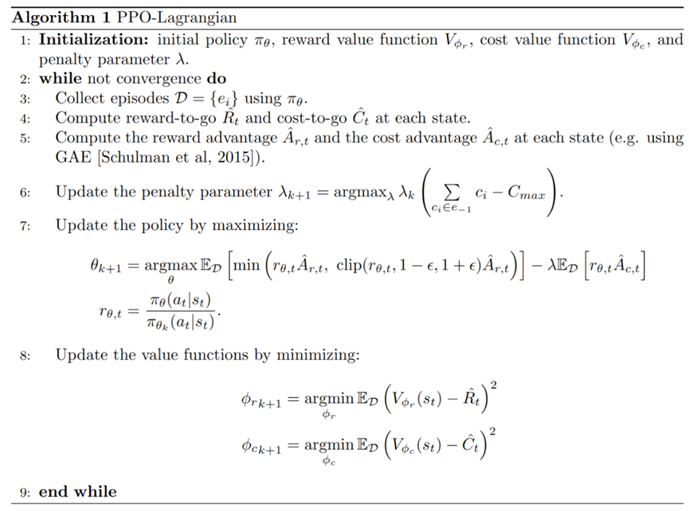

PPO initial code(model) reference from https://github.com/Lizhi-sjtu/DRL-code-pytorch , Zhihu https://zhuanlan.zhihu.com/p/512327050

PPO Lagrangian is stored in model_safe folder. 

A detailed explanation of the code is published in https://blog.csdn.net/cxzzjw/article/details/145757560

Refer to the following figure for the mathematical formula:

For brevity, the code has only model structure and no environment to build